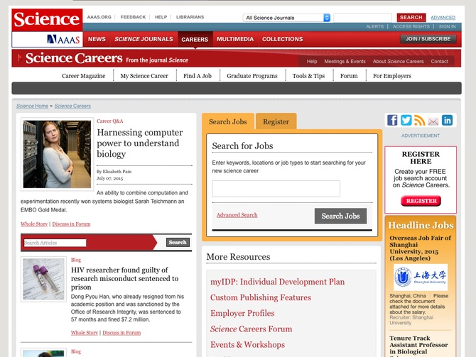
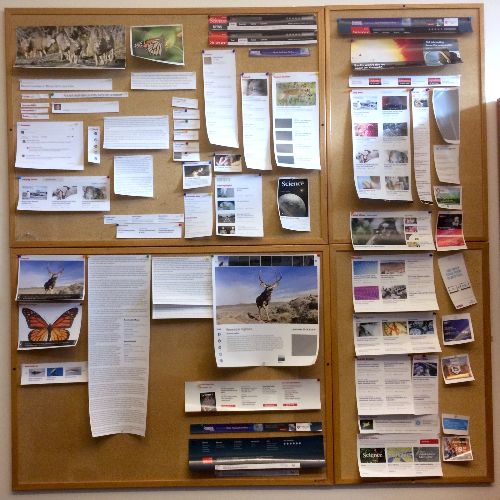
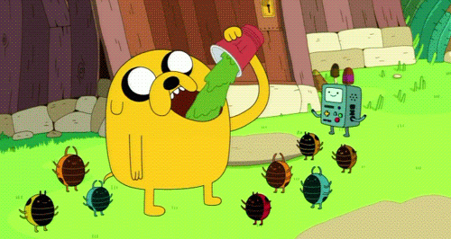

# Styleguide-Driven Development

Note:

--

## OR

--

# Design as a Dependency

Note: Describe presentation

I'm also going to cover a few tools that I use regularly, some of which you may already be familiar with, but this may be a novel implementation.

---

### Chris Coleman  
Senior Web Developer  
AAAS/<i>Science</i>

[github.com/freshyill](https://github.com/freshyill)  
[@freshyill](https://twitter.com//freshyill)

Note: Who am I?

What is AAAS
What is Science

What do I do?

What have I been working on?

---

## Design tends to drift

Note: This isn't the huge problem it once was. We're all using source control these days. That's the biggest thing you can do to keep design in check on a single site.

But what if you're *not* building a single site? It's completely common for one site to be composed of several different applications. The example I'm going to focus on is when you have one design that powers multiple sites.

The problem with maintaining a design across multiple sites is that it means you need to either move your styles around or rewrite them for each site. Rewriting is a recipe for disaster. Trust me—you're not going to get it exactly right. So that leaves moving them around. This isn't something you want to do manually. It's just a problem waiting to happen, and besides that, it's another thankless task that needs to get done over and over again.

---

## Machines to the rescue

Note: Luckily, we've got machines to do thankless tasks for us out these days. I probably don't need to tell you about the proliferation of tools we've seen over the past few years, but here are a few that we'll be focusing on.

--

### Sass

Note: This is *hardly* a new technology at this point. But it is still exciting and constantly evolving. For many developers, Sass started out as a way to avoid design drift. The variables in Sass are one of the easiest things to grasp, especially when you're not coming from a programming background. Anybody has ended up with a slightly-off shade of red can appreciate the power of just saying `color: $highlight` instead of trying to remember an RGB or hex value.

--

### Pattern Lab

Note: You've heard of this, right?

This can't *possibly* be the first time you've heard of Pattern Lab. I've seen plenty of presentations on it—some are good, some are kind of "meh". Pattern Lab is just one of the things I'm going to touch on in this talk. It's an important part of *my* workflow, but there are many alternatives such as KSS and others.

--

### Gulp

Note: You've heard of this too, right? Gulp can do pretty much anything. You could just as easily use Grunt for all this, but I prefer Gulp. My workflow relies on Gulp to do much of the heavy lifting. It compiles Sass, checks Javascript for errors, compresses images, and moves all manner of things around. It's a general workhorse, and you can probably find a way to tell Gulp to do anything that you find yourself doing more than once.

--

### BrowserSync

Note: You may have heard of this too, right? It's basically a thing that automatically (and very quickly) reloads changes in your browser, and keeps multiple browsers in sync. It's invaluable for building responsive designs because it lets your automatically see the effects of a single change on any class of browser or device type.

Incendiary opinion alert: This is way better than LiveReload.

--

### Jenkins

Note: We're also going to talk about Jenkins a bit.

Fair warning: Jenkins is getting into next-level territory for a CSS presentation. I'm not a Jenkins expert, and this is where my own examples will get a little less precise. But you don't need to be an expert. The cooperation of your friendly neighborhood devops engineer will probably be necessary for the last mile of this workflow.

---

## A real life example

Note: So now it's time to look at a real life example.

--

## Science Redesign

Note: This was our old design.

Since 2007 or so, Science has only seen evolutionary design changes, including a small homepage refresh we launched just over a year ago.

--

## Out with the old

  
  
  

Note: Believe it or not, this won a design award. We rushed this out, and in many ways it shows. A contractor put this together while *we* launched a small redesign on our news site.

But we immediately started to see design drift. These sites were both designed by the same guy, but there's lots of things that are just *a little bit off*.

These sites are built on completely different platforms. One is Drupal, which is often an uphill battle to get things *just right*, and the other is a legacy journal platform, which makes Drupal look like an absolute dream for a front-end developer, by comparison.

We knew this design wasn't exactly what we wanted, but we learned to live with it because we knew it had a very limited lifespan and we would soon begin work on a much larger scale redesign project.

--

## In with the new

  
  
  
  
  
  

Note: As soon as we launched that design, we started on the new one. And unlike the last one, it wasn't just a coat of paint. This was an entirely new house. Or six new houses, to be more precise.

Scholarly publishing is not like regular publishing. It's not just a matter of putting some content into a CMS and hitting the publish. Content needs to be converted into very specific formats, and there are a lot of very precise metrics involved. So we rely on various vendors to help us with this. Our scholarly content is hosted with a vendor, but many other parts of our web site are built with more familiar technologies, primarily Drupal, WordPress and Jekyll.

The design process leading up to the implementation of this redesign was anything but modern. You know the joke about homepage-final-revision-6-final-FINAL.psd—well, well it's not a joke. That's what we were given. And that's what our journal platform vendor was given. Stacks and stacks of PSDs. So while we started implementing these PSD comps on our homepage and blog sites—using stock Drupal, our vendor started implementing the same designs on their specialized Drupal platform.

It wasn't far into the implementation before we realized our vendor was having problems. The first site using the redesign launched during the AAAS Annual Meeting in February. There was a board meeting happening at the time of the launch, and when the board members tried to open the newly-launched Science Advances site on their phones, the results weren't pretty. It was completely unusable on mobile devices.

But I had a solution…

---

## Pattern Lab to the rescue

Note: From the very start, I had gone all-in on a Pattern Lab and Gulp-based workflow. After the design drift issues we had with our temporary redesign, I knew that closely managing this design was an absolute must. Our vendor got their best front-end developer on the job and we started working closely together. She forked my Pattern Lab project and she began making pull requests to implement elements that I hadn't needed to create yet. Within about two weeks, we had ported the entire design to our vendor's Drupal theme.

This worked because we were using the very same CSS codebase.

---

## Get to know your design

Note: So let's get started. I hate to bring ink and paper into this, but it can be useful to have something physical to help you really understand what you're getting into. This is actually what our war room looked like. You probably don't have access to printers that can do this. But that's OK. Work with what you've got.

The very first order of business is to make sense of them! A little bit of planning goes a long way. If you are going to be the steward of a design, you need to truly *understand* it.

--

## Go deeper

Note: A bunch of comps or wireframes is a great start but you need to *really* know what you're getting yourself into. Printing them is just the start. We need to go deeper.

--

## Break it down

Note: Get an understanding of what you're creating before you start writing code.

Remember all those PSDs I mentioned?

If you're implementing a design that was given to you after going through a "legacy" design process—that is, one with lots of PSDs, you're going to quickly start to notice inconsistent and redundant elements.

Knock these out. Seriously.

Make an executive decision or get an answer out of your designer and decide which is the right one. In a large enough project, you're going find plenty of elements that either don't have a clear purpose, or serve essentially the same purpose as another element. Don't create more elements than you need to. Every one-off element adds overhead to your project. Do you really want to maintain three different carousels or tabbed elements? If it turns out the similar-but-different elements actually have different enough *meanings* or *functionality*, then build both—but understand the differences and document them.

Pattern Lab provides methods to help you easily create and maintain variations on elements. You can make one element and then throw slightly different styles at it and end up with as many variations as you need, without repeating yourself.

--

## Atomic Design

  
  
  
  
  
  
  
  
  
  
  
  
  
  
  
  

Note: Since we're using Pattern Lab, we're going to apply the principles of Atomic Design. You're probably going to identify a lot of elements. I broke it all down on a whiteboard. Remember: Get organized. Depending on your team's workflows, you might want to get all of these things into your project tracking system. Your project managers will thank you. Or hate you, depending on how overworked they are.

Once you've broken things down, start naming what you've got. This is the start of your Atoms, Molecules, and Organisms that will be the basis of everything you build in Pattern Lab. I could go on and on about the details of using Pattern Lab, but that's already been done plenty of times, and besides that, the documentation is excellent. I'm going to touch on it, but I won't get too far into the weeds.

---

## Using Pattern Lab

Note: Pattern Lab is really easy to use. There's definitely a learning curve, but you can be productive in pretty much no time.

Dave (Olsen) and Brad (Frost), the creators of Pattern Lab, tell you that you should start by tossing the demo files. Before you do that, study them a bit. It's the best resource you've got to help you understand how all of this is put together. Even though you should pull them out of your project, consider keeping a copy handy to refer back to.

The hardest thing about Pattern Lab isn't writing a bunch of JSON data or Mustache templates, it's deciding what's what. Your Atoms should be fairly straightforward to identify. But what's a Molecule? What's an Organism? Can a Molecule include another Molecule? Certainly, but are you sure you want to do that? That's a call you need to make. You can even blow out the entire metaphor of Atomic Design and come up with your own system. Pattern Lab is super flexible—it's just a matter of renaming the folders.

---

## Gulp

Note:

=-=-=-=
Here it is in just a few commands.  
Without getting too detailed, what we're doing here is installing Homebrew, Node and Gulp.

    ## Here's how to install Gulp, if anybody's curious
    $ ruby -e "$(curl -fsSL https://raw.githubusercontent.com/Homebrew/install/master/install)"
    $ brew install node
    $ npm install -g gulp
=-=-=-

So you've got Pattern Lab installed. Remember how we're pulling pretty much everything out of it? Well, we need to replace it with something. And in this case, we're starting with the styles. And because we're not savages, we're using Sass.

You might already be familiar with Gulp. If not, don't worry. It's not hard to get up and running.

--

####[sdd-pl-demo](https://github.com/freshyill/sdd-pl-demo)

Note: We're on the cusp of turning this into a Node project. Normally you'd start a Node project by typing `npm init`. You could do that, but I've got a starter project on GitHub for you to fork. Fork it, pull it down locally, type `npm install`, and you should be all set.

This is going to be out of date as soon as Dave Olsen makes a change to Pattern Lab. So while you probably don't want to use this repository to start your own projects, you can still use the package.json, Gulpfile, and a few other things to help get you started.

There's probably some good Yeoman generators out there to help out with stuff like this, but again, that's overkill because we're focusing on principles. Unless you're giving the exact same talk that I'm in the middle of giving, I don't expect what's here to work for anybody out of the box. Besides, that would not be cool. So dig in and take what you need, but realize there's no one-size-fits-all solution. You're going to have to learn to write a Gulpfile, but I swear it's easy. And this repository will help you get started. These slides are online, and the repository is linked from right here.

--

## Wait&hellip; what?

<code class="fragment">`$ gulp`</code>

Note: Yeah we just did a whole lot. Let's recap: If you dig into the Gulpfile in the project I provided, you've got a Pattern Lab site, with Gulp, Sass and BrowserSync all set up.

These things aren't terribly difficult to do, but this basic Gulpfile gives you a few common things to help you get up and running. I've already taken the liberty of installing the Pattern Lab demo files, but I deleted all of the styles and replaced them with the necessary files to get started with Sass.

Now, all you need to do is type `gulp`.

Let's check it out in action.

---

### Demo time

Note: I've been talking a lot here but now it's time to show you some of this in action.

* [ Window 1: Split Terminal: Pattern Lab, Gulp, spare ]
* [ Window 2 ]
  * sdd-demo-projectA
   * index.html
  * sdd-demo-projectB
  * sdd-demo-projectC
  * sdd-pl-demo
    * gulpfile.js
    * Show off Pattern Lab structure - source, public, etc.
* [ Window 3: Safari Tabs: Pattern Lab, Demo A, Demo B, Demo C, Jenkins ]
* [ Window 4: Chrome: Pattern Lab ]

## Gulpfile

### Window 1
* Let's start Pattern La

### Window 2
* Let's break down the Gulpfile - refer to comments
* Time to fire up Gulp

### Window 3
* Here's Pattern Lab and a few demo projects — they're almost completely empty — we'll get to them soon

### Window 4
* Demo BrowserSync

---

Note: OK, that was pretty basic. Let's do something a little more interesting.

--

## Try this

    $ gulp styles --projectA

Or this

<code class="fragment">

    $ gulp styles --projectA --projectB --projectC

</code>

Note: Now we're getting somewhere. We *could* just create a ton of tasks, but this is more elegant. We're using `gulp-util` to tack on some flags to our gulp command. This gives us some control over what a given task does, without having to create near-duplicate tasks.

When we run Gulp with these flags, the projects all end up with the same styles — and that's the entire point! With Pattern Lab and pretty basic Gulpfile, we've kept styles completely consistent across multiple projects with no extra work.

So how do you know your styles are going to work in these other projects? Just keep your markup and classes in line with what you've created in Pattern Lab, and you should be good. You won't always have complete control over your markup, so take advantage of Sass mixins, functions, and extends to apply the styles to different selectors.

If you're building an application that uses Mustache or Twig templating, it's possible, with a little creativity, to extend your Gulp workflow to copy your templates from Patten Lab into your projects, in addition to your styles.

And let's not assume that all of these designs are *exactly* the same.

---

## Jenkins

Note:

Everything I've mentioned up to this point may be enough if you're doing client work or working on a particularly small team.

The next step is working this into a larger workflow.

You might not want to commit the CSS generated by Gulp into your projects. We're talking about design as a *dependency*, after all.

The last machine we're going to talk about is Jenkins.

Jenkins is a continuous integration tool. There are many other similar tools such as Hudson and Travis CI. Some people have strong opinions about these things, but I don't. Jenkins is what I've worked with, so that's what you're getting. If Jenkins isn't an option, or isn't something you need, the Gulp workflows we looked at still get you most of the way there.

Generally, Jenkins is always up and running and waiting for your code to show up so it can build it and deploy it, but you can also press a button to run a build. Let's walk through that right now.

---

### Demo time (again)

---

Note:

---

# Thank you!

### Chris Coleman  
Senior Web Developer  
AAAS/<i>Science</i>

[github.com/freshyill](https://github.com/freshyill)  
[@freshyill](https://twitter.com//freshyill)
